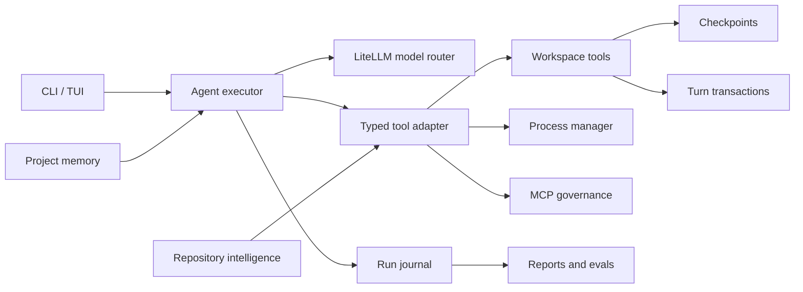

# Agent runtime

Apsara's runtime is deliberately local-first. The model proposes actions, but
the CLI owns permissions, execution, recovery, and durable state.

## Run lifecycle

Every user turn receives an `AgentRun` with `planning`, `executing`,
`verifying`, and terminal states. Its current snapshot is written to
`.apsara/runs/<run-id>/state.json`; append-only events go to `events.jsonl`.
The UI receives compatible JSON events, so older event consumers continue to
work while newer clients can display the plan and run state.

Tool strings are adapted into `ToolResult` at the runtime boundary. This keeps
existing local plugins compatible while giving the executor a typed success,
error, and metadata contract.

## Safety and recovery

- All built-in paths resolve beneath the selected workspace.
- Writes remain approval-gated and create a checkpoint before mutation.
- `/undo` restores the latest snapshot, including removing a newly created file.
- `/undo-turn` restores all captured mutations from a completed or interrupted
  agent turn. Non-empty directories created after capture are left untouched
  and reported as conflicts rather than recursively deleted.
- `/diff` shows the repository's staged, unstaged, and untracked state without
  mutating Git.
- Shell and background commands share the same allowlist validation.
- Background output is bounded and processes are terminated when Apsara exits.
- MCP `readOnlyHint` annotations are honored. Without an annotation, conservative
  name classification is used; external mutation-like calls need approval and
  are blocked by `--read-only`.
- Workspace plugin code and its optional manifest share a trust digest, so
  changing either invalidates prior approval.

## Reliability

After a successful workspace mutation, the executor requests command-based
verification when bash is enabled. Repeated identical actions and failed calls
are detected and redirected before the step budget is exhausted. Set
`APSARA_FALLBACK_MODELS` to a comma-separated model chain for failures that
occur before response output begins.

Cancellation marks the current run `cancelled`. Long-running work should use
the managed background-process tools so output can be inspected and the process
can be stopped independently. In the TUI, `Ctrl+C` cancels the active agent turn
and preserves the application, prior conversation, and automatic checkpoints.

## Extensibility and evaluation

Repository maps and symbol search cover common Python, JavaScript/TypeScript,
Go, Rust, Java, Ruby, PHP, C#, and C/C++ definitions without a heavyweight
index. Persistent user-maintained context lives in `.apsara/memory.md`.

`apsara eval` scores recorded traces deterministically. This separates runtime
regression checks from paid, nondeterministic model calls and makes tool-use
expectations suitable for CI.
